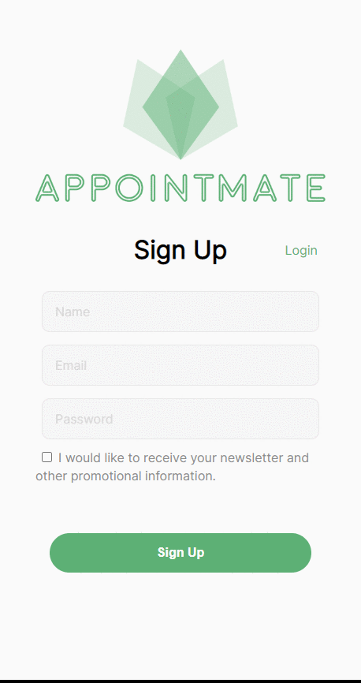
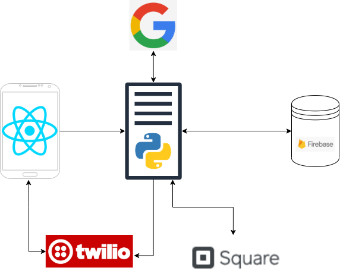

# AppointMate
Repo for the square small business hackathon: https://devpost.com/software/salon-boi

# Requirements
  Python3
  Flask
  React.js
# Installation
## Frontend
    npm install
    npm start
    Open browser and visit http://localhost:3000
## Backend
    . venv/bin/activate
    export FLASK_APP=app.py
    flask run

# Preview

# Stack

